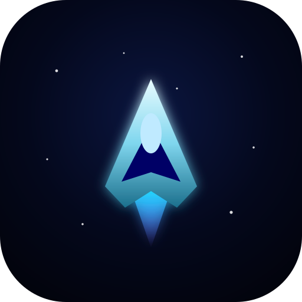

# 🚀 Starfall: Armada

**A fast, polished arcade space shooter — built with pure HTML5 Canvas, Web Audio and PWA tech. Zero runtime dependencies, instant load, installable, and app-store ready via Capacitor.**

> Hold the line against the swarm. Chain kills, upgrade your guns, survive the bosses, top the leaderboard.



---

## ✨ Features

- **60 fps fixed-timestep engine** — deterministic simulation, variable-rate rendering, screen shake, hit-flash and a damage-vignette flash system.
- **Four enemy archetypes** — drones, fighters, heavy tanks and diving kamikazes, each with distinct movement and fire patterns. Difficulty scales every wave.
- **Multi-phase bosses every 5th wave** — five named capital ships with escalating attack patterns (aimed bursts, radial barrages, sweeping fans, bullet spirals) and a live health bar.
- **Tiered weapons & power-ups** — five gun tiers plus rapid-fire, shield charges, bombs and extra lives that drop from kills.
- **Abilities** — energy **shield** (cooldown) and screen-clearing **bombs**.
- **Combo system** — chain kills for up to an 8× score multiplier.
- **Procedural audio** — every sound effect and the background music track are synthesised at runtime via the Web Audio API. No audio files, no load time.
- **Parallax starfield + drifting nebulae**, pooled particle explosions, thruster trails and vector-drawn ships that stay crisp at any resolution / DPR.
- **Full input support** — keyboard, mouse drag-to-fly, and a mobile virtual joystick + action buttons. Auto-detects touch devices.
- **Persistent local leaderboard** and settings (sound, music, screen-shake, FX quality) via `localStorage`.
- **Installable PWA** — offline play, fullscreen, custom icons and splash, service-worker cached app shell.

---

## 🎮 Controls

| Input | Action |
| --- | --- |
| `W A S D` / Arrow keys | Fly the ship |
| Mouse / touch drag | Fly the ship (fire is automatic) |
| Mobile joystick (bottom-left) | Fly the ship |
| `SHIFT` / 🛡 button | Raise energy shield |
| `SPACE` / 💥 button | Detonate a bomb |
| `P` / `ESC` / ‖ | Pause |

Firing is **automatic** — focus on dodging and positioning.

---

## 🏃 Run locally

No build step. The game uses native ES modules, so it must be served over HTTP (not opened as a `file://`).

```bash
npm start          # zero-dependency static server → http://localhost:5173
npm run cf:dev     # wrangler dev — emulates the Worker + /api routes locally
```

Then open the URL in a browser. To verify everything works headlessly (drives a real run, checks for console errors + icon loads, captures screenshots):

```bash
npm i -D playwright-core   # one-time, uses the system Chromium
npm run verify
```

---

## ☁️ Hosting — Cloudflare (starfall.valentin.is)

The whole product is **one Cloudflare Worker** with Static Assets: `./public` is
served at the edge, and `/api/*` is reserved for the Phase-3 backend (auth + Stripe).
Deploy with `npx wrangler deploy`, or connect this repo in the Cloudflare dashboard
(Workers Builds) for push-to-deploy. **The game is live at <https://starfall.valentin.is>.**

Full step-by-step guides:
- **[`docs/CONFIGURE.md`](docs/CONFIGURE.md)** — click-by-click dashboard runbook
  (deploy, custom domain, D1, secrets, Google OAuth, Stripe, Resend). Verified against live docs.
- [`docs/DEPLOY-CLOUDFLARE.md`](docs/DEPLOY-CLOUDFLARE.md) — CLI deploy + custom domain.
- [`docs/PHASE3-AUTH-PAYMENTS.md`](docs/PHASE3-AUTH-PAYMENTS.md) — auth + leaderboard + Stripe code blueprint.

---

## 🗂 Project structure

```
.
├── wrangler.jsonc            # Cloudflare Worker config (static assets + /api + custom domain)
├── worker/index.js           # Worker entry: serves ./public, reserves /api/* (Phase 3)
├── capacitor.config.json     # Native app packaging config (webDir: public)
├── public/                   # ← everything served to the browser (the game)
│   ├── index.html            # App shell: canvas, HUD, all menu screens
│   ├── favicon.ico           # Multi-res 16/32/48 favicon
│   ├── _headers              # Per-path Content-Type / Cache-Control for Cloudflare
│   ├── manifest.webmanifest  # PWA manifest
│   ├── sw.js                 # Service worker (offline app-shell cache)
│   ├── styles/main.css       # UI styling (brand palette: navy #000066 / teal #005577)
│   ├── assets/icons/         # SVG master + generated PNG app icons
│   └── src/
│       ├── main.js           # Bootstrap: wiring, boot sequence, SW registration
│       ├── core/             # Game.js, Renderer.js, Input.js, AudioManager.js,
│       │                     #   ParticleSystem.js, Starfield.js, Storage.js, utils.js
│       ├── entities/         # Player, Enemy, Boss, Bullet, PowerUp
│       └── ui/UI.js          # DOM screen routing + HUD updates
├── tools/
│   ├── serve.js              # Zero-dependency dev server (serves ./public)
│   ├── generate-icons.mjs    # Render PNG icons + favicon.ico from the master SVG
│   └── verify.mjs            # Headless smoke test
└── docs/
    ├── DEPLOY-CLOUDFLARE.md      # How to host at starfall.valentin.is
    └── PHASE3-AUTH-PAYMENTS.md   # Auth + leaderboard + Stripe blueprint
```

**Tech:** Vanilla JavaScript (ES2022 modules), HTML5 Canvas 2D, Web Audio API, Service Workers. **No frameworks, no bundler, no runtime dependencies.** Hosted on a single **Cloudflare Worker** (Static Assets) so the game and the future `/api/*` backend (auth + Stripe) ship together.

---

## 📱 Ship it to the App Store & Google Play (Capacitor)

The web game is wrapped into native iOS/Android apps with [Capacitor](https://capacitorjs.com). The web assets load from the app bundle, so ES modules and the PWA features work offline out of the box.

### 1. Install Capacitor

```bash
npm install @capacitor/core
npm install -D @capacitor/cli
npm install @capacitor/ios @capacitor/android @capacitor/splash-screen @capacitor/status-bar
```

`capacitor.config.json` is already configured (`appId: com.cashxchain.starfall`, `webDir: public`).

### 2. Add the native platforms

```bash
npx cap add ios
npx cap add android
npx cap sync          # copies web assets + config into the native projects
```

### 3. App icons & splash

```bash
npm run icons                          # regenerate web icons from assets/icons/icon.svg
npx @capacitor/assets generate         # generate native icon/splash sets for both platforms
```

### 4. iOS — build & submit

```bash
npx cap open ios       # opens Xcode
```
In Xcode: set your **Team / signing**, bump the version & build number, then **Product ▸ Archive ▸ Distribute App ▸ App Store Connect**. Requires a macOS machine with Xcode and an Apple Developer account ($99/yr).

### 5. Android — build & submit

```bash
npx cap open android   # opens Android Studio
```
In Android Studio: **Build ▸ Generate Signed Bundle (.aab)**, sign with your upload key, then upload the `.aab` to the [Google Play Console](https://play.google.com/console) ($25 one-time).

### 6. Store-listing checklist

- [x] App icons (1024² for iOS, 512² for Play) — generated from `assets/icons/icon.svg`
- [x] Privacy: **no personal data collected**, no network calls, no tracking, no ads — declare "Data not collected" in both stores
- [x] Offline-capable, no account required
- [ ] Screenshots per device class (use `tools/verify.mjs` output as a starting point)
- [ ] Store description, keywords, age rating (PEGI 7 / ESRB E — mild fantasy violence)
- [ ] Support URL & marketing copy

> ⚠️ Native archiving requires the platform toolchains (Xcode on macOS / Android Studio) and paid developer accounts. Everything in this repo — the game, config and assets — is ready for that final step.

---

## 🛡 Privacy

Starfall collects **nothing**. No analytics, no network requests, no accounts. Scores and settings live only in your device's `localStorage`.

## 📄 License

MIT © CashXChain
